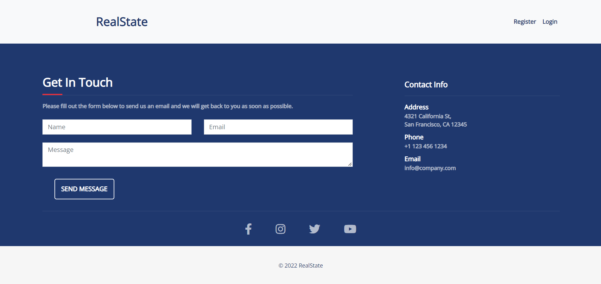
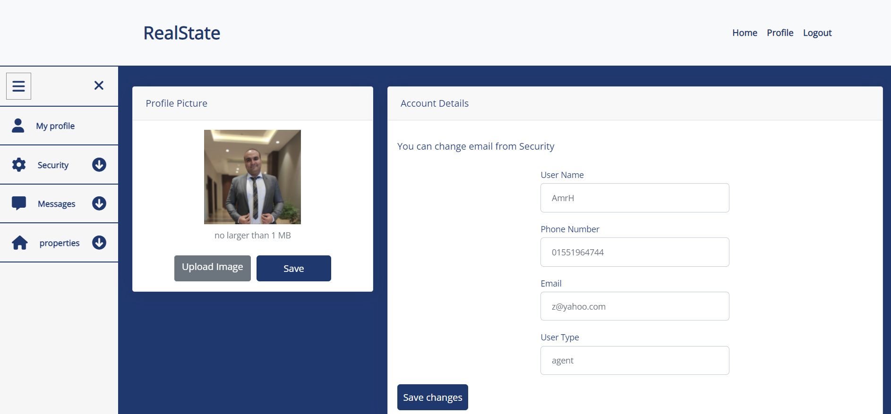
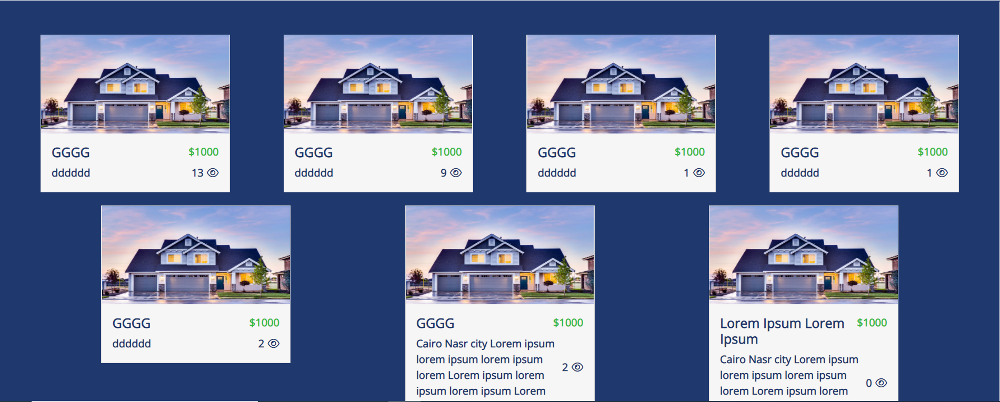

# properties-social-engine

[](https://nodejs.org/en/) [](https://expressjs.com/) [](https://www.mongodb.com/) [](https://AngularJS.org/) [](https://getbootstrap.com/)  [](https://sass-lang.com/)  

## About this project
This project is a fullstack JavaScript project.
It is a platform for real estate (Social Engine) where there are two types of users :
- agents : can add properties to the platform 
- clients : can search for properties, add a property to their favourites and contact agents <br/>

heroku link : https://social-engine-frontend.herokuapp.com/

## How to start this project on your local machine?
clone the respitory on your local machine then go to backEnd folder then open your terminal and type 
```sh
$ nodemon seedProperties.js
```
this will seed dump data in the database then start the backend by
```sh
$ nodemon index.js
```
then go to frontEnd folder and type in terminal 
```sh
$ ng serve
```

## APIs and Functionalities :
there are 3 types of APIs
###### 1 - APIs for all users (both clients and agents)
* Register
* Login with the use of JWT 
* Activate Email
* Logout / Logout from all devices
* Retrieve password 
* Edit Profile
* Add Avatar
* Change Email or Password
* Show one property
* Search for properties
* Send and recieve messages

###### 2 - APIs for agents 
* Add/delete property
* Show his properties 

###### 3 - APIs for clients
* Add/delete Property to favourites
* Show All favourites
 
###### Other Functionalities
* calculate how many users viewed a certain property

## Screenshots of the website






## Under Developement
* Infrom user with the errors coming from the back end
* Add refresh token
* Apply the Messages in the front end
* Use Socket IO in the backend for messages
